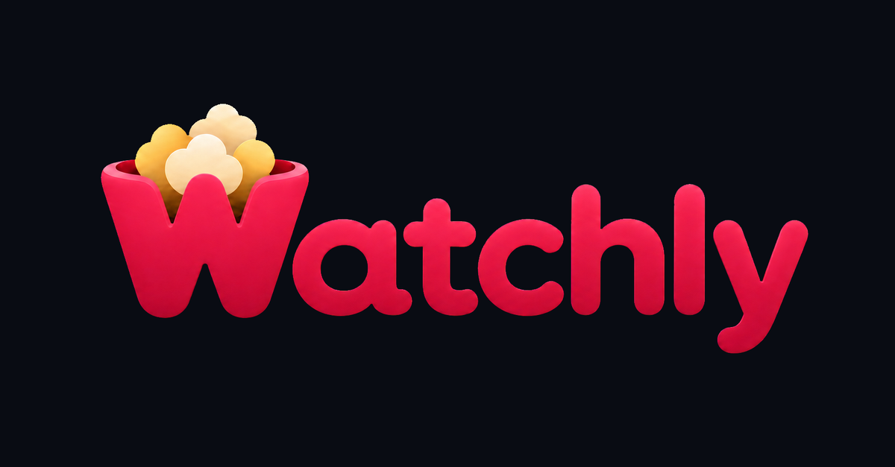
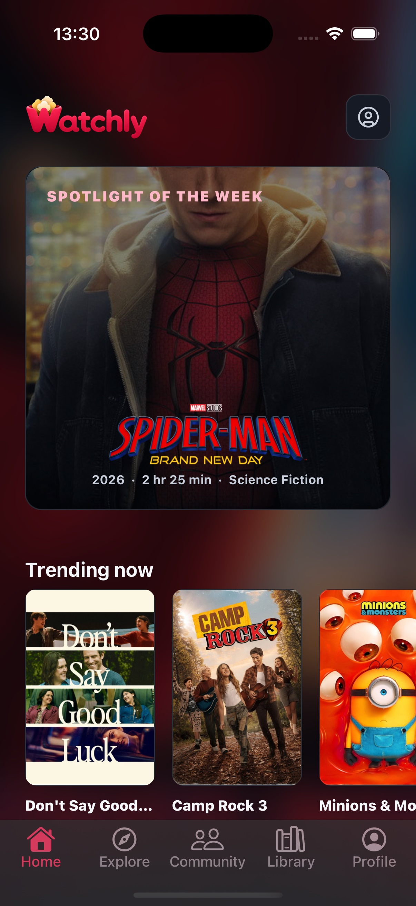
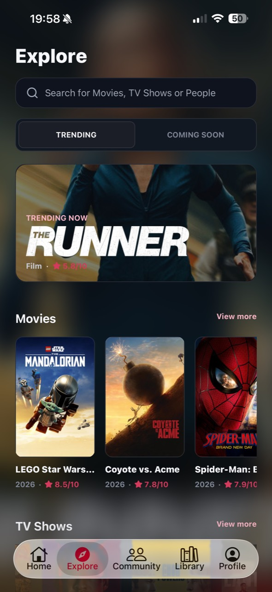
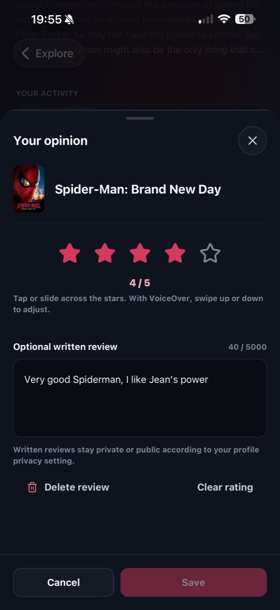

<p align="center">
  
</p>

<h1 align="center">Watchly</h1>

<p align="center">
  A cinematic social tracker for films and TV series, built for iOS, Android, and the web.
</p>

<p align="center">
  
  
  
  
  
</p>

## Overview

Watchly brings discovery, tracking, personal history, and conversation into one product. Users can find films and series, follow their progress down to individual episodes, keep personal or shared watchlists, publish ratings and reviews, and see activity from people they follow.

The repository is a pnpm monorepo containing the mobile application, the backend API, a public web experience, and a reserved shared-package workspace.

<table>
  <tr>
    <td width="33%" align="center">
      <br />
      <sub>Home</sub>
    </td>
    <td width="33%" align="center">
      <br />
      <sub>Explore</sub>
    </td>
    <td width="33%" align="center">
      <br />
      <sub>Rating &amp; review</sub>
    </td>
  </tr>
</table>

## Product highlights

- Film and series discovery backed by TMDB metadata
- Detailed movie, series, season, and episode pages
- Continue Watching and per-episode progress tracking
- Movie, series, and episode ratings and reviews
- Personal journal and viewing statistics
- Personal and shared watchlists with collaborative voting
- Social feed, profiles, follows, likes, and profile privacy controls
- Release calendar, release alerts, in-app notifications, and push notifications
- Data import flows for Letterboxd, IMDb, and TV Time exports
- Account linking across supported identity providers
- Blocking, reporting, moderation, and administrative review tooling
- Cache-first mobile states for loading, refresh, empty, offline, and error scenarios

## Architecture

```text
apps/
├── mobile/   Expo + React Native application for iOS and Android
├── api/      NestJS API, Prisma schema, background jobs, and integrations
└── web/      Next.js landing site, legal pages, waitlist, and admin console

packages/
└── shared/   Reserved workspace for future shared code
```

| Layer | Main technologies |
| --- | --- |
| Mobile | Expo, React Native, React Navigation, TanStack Query, Reanimated |
| API | NestJS, Prisma, PostgreSQL, Joi validation, rate limiting |
| Web | Next.js, React, Firebase client SDK |
| Authentication | Firebase plus Apple, Google, Microsoft, and Discord provider flows |
| Media data | TMDB catalogue integration |
| Storage and delivery | Cloudflare R2-compatible object storage and Expo push notifications |
| Observability | Sentry integrations and structured monitoring endpoints |

## Prerequisites

- Node.js 20.9 or later
- pnpm `10.28.2`
- PostgreSQL
- A Firebase project
- TMDB credentials for live catalogue data
- Xcode for iOS builds and Android Studio for Android builds

Additional provider, storage, notification, and observability credentials are optional in local development but required for the corresponding integrations.

## Getting started

### 1. Install dependencies

```bash
git clone https://github.com/tomhubert50400/Watchly.git
cd Watchly
pnpm install --frozen-lockfile
```

### 2. Configure the environments

```bash
cp apps/api/.env.example apps/api/.env
cp apps/mobile/.env.example apps/mobile/.env
cp apps/web/.env.example apps/web/.env.local
```

At minimum, configure `DATABASE_URL` and `FIREBASE_PROJECT_ID` for the API. The example files document the remaining variables and which integrations use them.

Never commit real credentials or service-account JSON.

### 3. Prepare the database client

```bash
pnpm --filter api prisma:generate
pnpm --filter api db:migrate
```

### 4. Start the applications

Run each service in a separate terminal:

```bash
# Backend API
pnpm --filter api start:dev

# Expo mobile app
pnpm --filter mobile start

# Public web app
pnpm --filter web dev
```

The mobile app reads its API URL and public authentication configuration from `apps/mobile/.env`.

## Quality checks

Once the local environment variables are configured, run the complete repository check:

```bash
pnpm check
```

This command runs the available lint, TypeScript, and QA suites across the API, mobile application, and web application.

Individual commands are also available:

```bash
pnpm lint
pnpm typecheck
pnpm test
pnpm --filter api build
pnpm --filter web build
```

## Application variants

The Expo configuration supports three isolated variants:

- `development`
- `staging`
- `production`

`APP_VARIANT` and `EXPO_PUBLIC_APP_ENV` must match. Each variant uses its own application identifier so development, staging, and production builds can coexist safely.

## Design and QA evidence

The repository includes implementation screenshots, accessibility checks, Android and iOS captures, wireframes, and social assets under [`screenshots/`](screenshots/) and [`design/`](design/). These files document the evolution of the product and the states exercised during UI verification.

## Status

Watchly is under active product development. The codebase includes production-oriented environment separation and operational tooling, but running every integration locally requires your own third-party credentials.

## License

This repository does not currently include an open-source license. All rights are reserved by the author.
